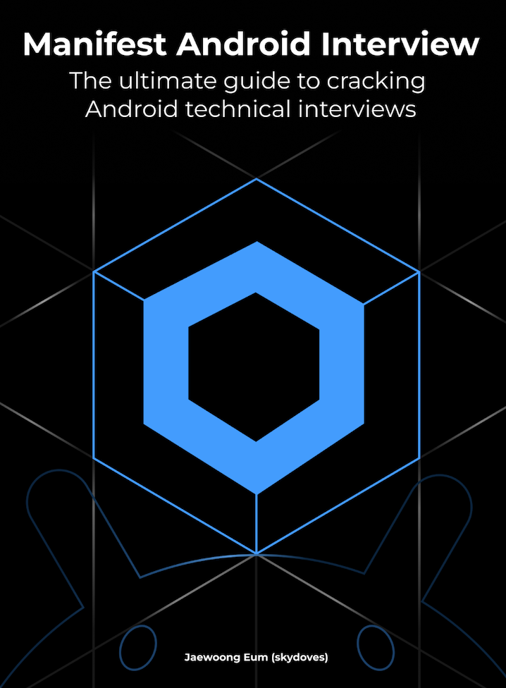

# 📚 『Manifest Android Interview』 스터디 📚

## 🎯 스터디 목표
- `Manifest Android Interview` 책 한 권 완독
- 매주 아티클 작성을 통한 학습 내용 정리 및 공유
- 동료와의 지식 공유 및 토론을 통한 심층적 학습

## 🧑‍💻 진행 방식
- **스터디 시간**: 매주 **화요일 23:00 - 24:00**
- **주간 활동**:
    1.  **발표**: 매주 발표자(3명)가 해당 주차에 학습한 내용을 발표합니다.
    2.  **아티클 작성**: 모든 스터디원은 한 주간 공부한 내용을 아티클을 md파일(Notion, 블로그 링크 첨부 대체 가능)로 작성하여 PR을 제출합니다.
    3.  **질문과 답변**: 모든 스터디원은 GitHub Issue에 질문을 1개 이상 등록하거나, 다른 사람의 질문에 답변을 1개 이상 작성합니다.

---

## ⚙️ GitHub Workflow

### 📁 폴더 구조 (Folder Structure)
- 모든 학습 아티클은 `docs/` 폴더 아래에 **개인 이름(영문)으로 된 폴더**를 생성하여 관리합니다.
- 개인 폴더 아래에는 주차별로 폴더(`week1`, `week2`...)를 만들어 파일을 정리합니다.
- **`docs/{YourName}/{week#}/...`** (해당 주차 폴더 내 파일명과 구조는 자유롭게 구성)
- **예시**: `docs/seungjun/week1/Android_Framework_Summary.md`

### 🌳 브랜치 (Branches)
- 브랜치 이름은 `주차/이름` 형식으로 생성합니다.
- **예시**: `week1/seungjun`

### 📝 Pull Requests
- PR 제목은 `[Week?] 이름-학습 주제` 형식으로 작성합니다.
    - **예시**: `[Week1] Seungjun-안드로이드 프레임워크(1/3)`
- PR 설명(Description)에는 어떤 내용을 다뤘는지 간단히 작성합니다.
- PR 생성 시, 관련된 **주차**와 **챕터** 라벨을 꼭 추가해주세요.

### 🤔 이슈 (Issues)
- 이슈 제목은 `[ch?-Q??] OOOO` 형식으로 작성합니다.
    - **예시**: `[ch00-Q10] Service와 IntentService의 차이`
- 이슈 생성 시, 관련된 **주차**와 **챕터** 라벨을 꼭 추가해주세요. (예: `week1`, `📘 ch00: Android Framework`)
- 질문에 대한 토론이 끝나고 해결이 완료되면 이슈를 닫습니다.

## 📅 커리큘럼 및 진행 현황

| 주차 | 주요 학습 파트 | 상세 범위 (문항) |
|:---:|:---|:---|
| **1주차** | 안드로이드 프레임워크 (1/3) | Q0 ~ Q11 | 
| **2주차** | 안드로이드 프레임워크 (2/3) | Q12 ~ Q22 | 
| **3주차** | 안드로이드 프레임워크 (3/3) | Q23 ~ Q32 | 
| **5주차** | Jetpack 라이브러리 | Q49 ~ Q58 | 
| **6주차** | 비즈니스 로직 | Q59 ~ Q66 |
| **7주차** | Compose Fundamentals | Q0 ~ Q10 | 
| **8주차** | Compose Runtime | Q11 ~ Q25 | 
| **9주차** | Compose UI (1/2) | Q26 ~ Q35 | 
| **10주차**| Compose UI (2/2) & 총정리 | Q36 ~ Q41 & 회고 |