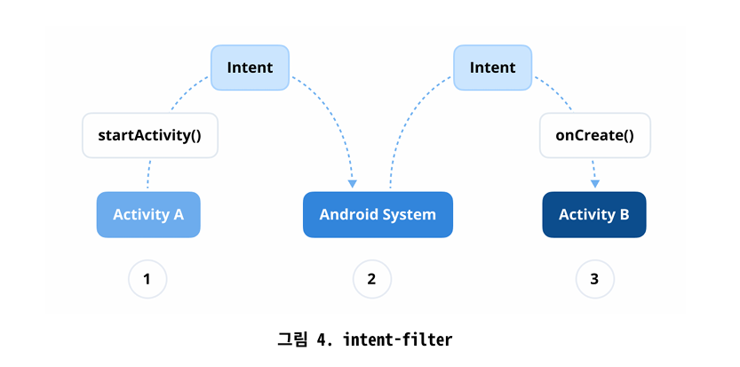

# Q1 ) 인텐트란 무엇인가요?

Intent는 수행될 작업에 대한 추상적인 설명으로, activity, service , broadcastreceiver 가 통신할 수 있도록 하는 메세징 객체 역할을 한다.

일반적으로 activity를 시작, 브로드 캐스트에 전송 , service 시작

컴포넌트 간에 데이터 전달이 가능하다.

1. **명시적 Intent (Explicit Intent)**
• 정의: 명시적 Intent는 호출할 컴포넌트(Activity 또는 Service)를 직접 이름으로 지정하여 정확히 명시합니다.
• 사용 사례: 명시적 Intent는 대상 컴포넌트를 알고 있을 때 사용 됩니다 (가령, 앱 내의 특정 Activity 시작).
• 시나리오: 동일한 앱 내에서 한 Activity에서 다른 Activity로 전
환하는 경우 명시적 Intent를 사용합니다.

```kotlin
val intent = Intent(this, TargetActivity::class.java)
 startActivity(intent)
```

**암시적 Intent (Implicit Intent)**
• 정의: 암시적 Intent는 특정 컴포넌트를 지정하지 않고 수행할 일반적인 작업을 선언합니다. 시스템은 액션(action), 카테고리 (category), 데이터(data)를 기반으로 어떤 컴포넌트가 Intent를 처리할 수 있는지 결정합니다.
• 사용 사례: 암시적 Intent는 다른 앱이나 시스템 컴포넌트가 처리할 수 있는 작업을 수행하려 할 때 유용합니다 (가령, URL 열기 또는 콘텐츠 공유).

```kotlin
val intent = Intent(Intent.ACTION_VIEW)
intent.data = Uri.parse("[https://www.example.com](https://www.example.com/)")
startActivity(intent)
```

명시적 Intent 는 대상 컴포넌트가 알려진 내부 앱 내비게이션에 사용된다. 암시적 Intent 는 대상을 직접 지정 x , 다른 컴포넌트가 처리할 수 있는 작업에 사용된다.

**안드로이드 시스템은 암식적 처리할 앱을 어떻게 결정하며, 적합한 애플리케이션을 찾지 못하면 어캐 됨?**

Intent Filters 란?



---

---