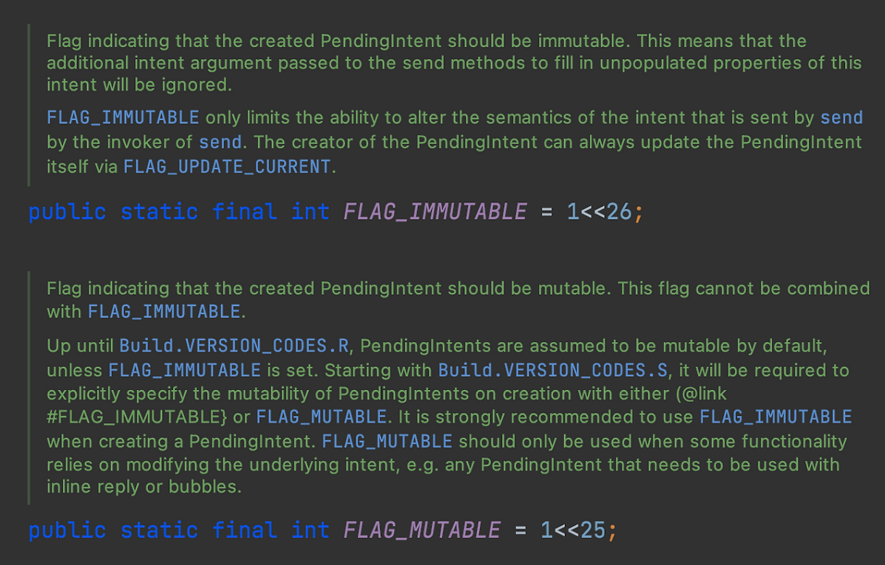

# Q2 ) PendingIntent의 목적은 무엇인가요?

PendingIntent 는 다른 애플리케이션이나 시스템 컴포넌트가 애플리케이션을 대신하여 미리 정의된 Intent를 나중에 실행할 수 있는 권한을 부여하는 또 다른 종류의 Intent입니다. 이는 알림이나 서비스와의상호작용과 같이 앱의 수명 주기를 벗어나 트리거되어야 하는 작업에 특히 유용합니다.

**PendingIntent의 주요 특징**

- PendingIntent는 일반 Intent의 래퍼(wrapper) 역할을 하여 앱의 생명주기를 넘어서 지속될 수 있도록 합니다. 이는 여러분의 앱과 동일한 권한으로 다른 앱이나 시스템 서비스에 Intent 실행을 위임합니다.
- PendingIntent는 Activity, Service 또는 BroadcastReceiver를 위해 생성될 수 있습니다.
PendingIntent는 세 가지 주요 형태로 사용될 수 있습니다.
• Activity: Activity를 시작합니다.
• Service: Service를 시작합니다.
• Broadcast: 브로드캐스트를 보냅니다

사례로는 

1. notifications : 사용자가 노티피케이션을 탭했을 때 activity 를 여는 것과 같은 작업을 허용합니다.
2. alarms : alarmmanger 를 사용하여 작업을 예약합니다.
3. service : 백그라운드 작업을 위해 foregroundService 또는 broadcastreceiver 에 작업을 위임합니다.

**보안 고려 사항**
악의적인 앱이 기본 Intent를 수정하는 것을 방지하기 위해 PendingIntent에는 항상 FLAG_IMMUTABLE을 설정해야 합니다. 이는 특정 시나리오에서 FLAG_IMMUTABLE가 필수인 안드로이드 12 (API 레벨31)부터 특히 중요합니다. (FLAG_MUTABLE을 명시적으로 사용해야 하는 경우 주의해서 사용해야 합니다.)

** [**FLAG_IMMUTABLE? FLAG_MUTABLE?**](https://linitial.tistory.com/39#FLAG_IMMUTABLE%3F%20FLAG_MUTABLE%3F-1)

<aside>

FLAG_IMMUTABLE
생성된 PendingIntent가 변경할 수 없음을 나타내는 플래그입니다. 
이는 이 인텐트의 채워지지 않은 속성을 채우기 위해 send 메소드에 전달된 
추가 인텐트 인수가 무시된다는 것을 의미합니다.
FLAG_IMMUTABLE은 send 호출자가 send에 의해 보낸 의도의 의미를 
변경하는 기능만 제한합니다. PendingIntent의 작성자는 항상 FLAG_UPDATE_CURRENT
를 통해 PendingIntent 자체를 업데이트할 수 있습니다.

FLAG_MUTABLE
생성된 PendingIntent가 변경 가능해야 함을 나타내는 플래그입니다.
이 플래그는 FLAG_IMMUTABLE과 결합할 수 없습니다.
Build.VERSION_CODES.R까지 FLAG_IMMUTABLE이 설정되지 않는 한 
PendingIntents는 기본적으로 변경 가능한 것으로 간주됩니다. 
Build.VERSION_CODES.S부터 (@link *#FLAG_IMMUTABLE} 또는 FLAG_MUTABLE* 을 사용하여 생성 시 PendingIntents의 변경 가능성을 명시적으로 지정해야 합니다.
PendingIntent를 생성할 때 FLAG_IMMUTABLE을 사용하는 것이 좋습니다. 
FLAG_MUTABLE은 다음 경우에만 사용해야 합니다. 
일부 기능은 기본 의도 수정에 의존합니다(예: 인라인 응답 또는 거품과 함께 사용해야 
하는 PendingIntent).

</aside>

⇒ TargetSdk32 부터 PendingIntent 가 변경이 가능한지, 불가능한지 FLAG 를 필수적으로 넣어줘야 한다는 내용입니다.

⇒ PendingIntent 는 앱이 활성 상태가 아닐 때에도 앱과 시스템 컴포넌트 또는 다른 앱 간의 원할한 통신을 가능하게 하는 안드로이드 핵심 메커니즘이다. 플래그와 권한을 신중하게 관리함으로써 지연된 작업의 안전하고 효율적인 실행을 보장할 수 있다.