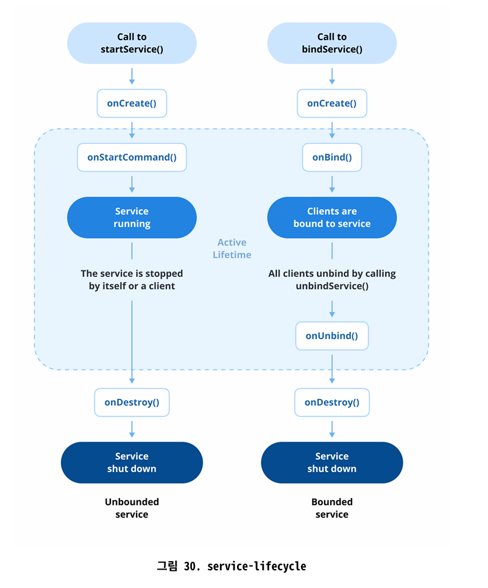

# Q9) Service 란 무엇일까요?

Service는 앱이 사용자 상호 작용과 독립적으로 장기적으로 작업을 수행할 수 있도록 하는 백그라운드 컴포넌트입니다. Activity와 달리 Service는 사용자 인터페이스가 없으며 앱이 포그라운드에 있지 않을 때도 계속 실행될 수있습니다. 일반적으로 파일 다운로드, 음악 재생, 데이터 동기화 또는 네트워크 작업 처리와 같은 백그라운드 작업에 사용됩니다

1. Started Service
Started Service는 앱에서 startService()를 호출할 때 시작됩니다. stopSelf()를 사용하여 스스로 작업을 중지하거나 stopService()를 사용하여 명시적으로 중지될 때까지 백그라운드에서 지속적으로 실행됩니다.
사용 예시
• 백그라운드 음악 재생
• 파일 업로드 또는 다운로드

1. Bound Service
Bound Service는 안드로이드의 컴포넌트가 bindService()를 사용하여 서비스에 바인딩할 수 있도록 합니다. Service는 바인딩된 클라이언트가 있는 동안 활성 상태를 유지하며 모든 클라이언트의 연결이 끊어지면 자동으로 중지됩니다.
사용 예시
• 원격 서버에서 데이터 가져오기
• 백그라운드 블루투스 연결 관리

1. Foreground Service (포그라운드 Service)
Foreground Service는 지속적인 알림을 표시하면서 활성 상태를 유지하는 특별한 유형의 Service입니다. 음악 재생, 내비게이션 또는 위치추적과 같이 사용자가 계속 인지해야 하는 작업에 사용됩니다.

Service 사용 모범 사례
• 즉시 실행이 필요하지 않은 백그라운드 작업에는 Service 대신
Jetpack WorkManager18를 사용합니다.
• 불필요한 리소스 소비를 방지하기 위해 작업이 완료되면 Service를
중지합니다.
• 투명성을 위해 명확한 알림을 제공하여 포그라운드 Service를 책
임감 있게 사용합니다.
• 메모리 누수를 방지하기 위해 생명주기 변화(Service 생명주기)을
적절하게 처리합니다.

