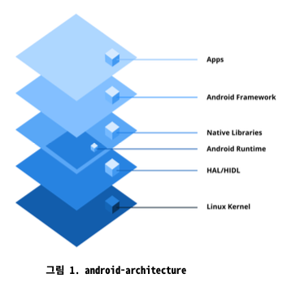

# Q) 0. 안드로이드란 무엇인가요?

안드로이드는 스마트폰과 태블릿과 같은 모바일 기기를 위해 주로 설계된 오픈소스 운영체제.
구글에 의해 개발 및 유지 관리 되며 리눅스 커널에 기반합니다.

### 안드로이드 OS의 주요 특징
1. 오픈 소스 및 커스텀화: 안드로이드는 오픈 소스이므로 개발자와 제조업체가 필요에
맞게 수정하고 커스텀할 수 있다. 웨어러블, TV, IoT 기기를 포함한 다양한 기기에서 사용됩니다.
2. SDK를 이용한 애플리케이션 개발: 안드로이드 앱은 SDK(Software Development Kit)를 사용하여
개발된다. 이를 통해 플랫폼에 맞는 애플리케이션을 설계, 개발 및 디버그 할 수 있습니다.
3. 풍부한 앱 생태계: 기본적으로 Google Play Store 라는 안드로이드 공식 앱 배포 스토어를 제공하고,
개발자는 서드파티 스토어 혹은 직접 다운로드를 통한 앱을 독립적으로 배포할 수도 있습니다.
4. 멀티태스킹 및 리소스 관리: 안드로이드에서 멀티태스킹을 지원하여 사용자가
여러앱을 동시에 실행할 수 있습니다. 관리형 메모리 시스템(MMS)와 가비지 컬렉션(GC) 를 사용해 최적화합니다.
5. 다양한 하드웨어 지원: 다양한 화면 크기, 해상도 및 하드웨어 구성과 광범위한 호환성을 제공합니다.

### 안드로이드 아키텍처
안드로이드 플랫폼 아키텍처는 모듈식으로 계층화 되어 있습니다.

- 리눅스 커널 (Linux kernel): 리눅스 커널은 안드로이드 운영체제의 기반으로,
메모리 및 프로세스 관리, 보안 강화, Wi-Fi, Bluetooth, 디스플레이와 같은
하드웨어 구성 요소의 장치 드라이버 관리를 담당합니다.
- 하드웨어 추상화 계층 (Hardware abstraction layer (HAL)): HAL은 안드로이드의
JAVA API 프레임워크를 기기의 하드웨어에 연결하는 표준 인터페이스를 제공합니다.
프레임워크 API 가 하드웨어 접근 요청시, 안드로이드 시스템은 해당 HAL 모듈을 동적으로 로드합니다.
- 안드로이드 런타임 및 코어 라이브러리 (ART 및 Core Libraries): ART는 Kotlin이나 Java에서
**컴파일된 바이트코드**를 사용하여 애플리케이션을 실행합니다. ART 는 최적화 성능을 위해
Ahead-of-Time (AOT) 및 Just-in-Time (JIT) 컴파일을 지원합니다.
- 네이티브 C/C++ 라이브러리 모음 (Native C/C++ Libraries): 안드로이드는 C 및 C++ 로 작성된
라이브러리 모음을 포함합니다. 대표적으로 OpenGL, SQLite, WebKit 등이 있습니다.
- 안드로이드 프레임워크 (APIs): 앱 개발을 위한 고수준 서비스와 API 를 제공합니다.
`ActivityManager`, `NotificationManager`, `ContentProviders`등이 포함됩니다.
- 애플리케이션 (Applications): 최상위 계층에는 시스템 앱과 안드로이드 SDK를 사용하여 
생성된 서드파티 앱을 포함한 모든 유저 기반의 앱이 포함 됩니다. 해당 계층은 사용자들과 상호작용합니다.

### 실전 질문
Q) 안드로이드 플랫폼 아키텍처는 Linux Kernel, Android Runtime
(ART), Hardware Abstraction Layer (HAL) 등 여러 계층으로 구성
됩니다. 이 구성 요소들이 애플리케이션 실행과 하드웨어와의 상호
작용을 위해 어떻게 작동하는지 설명해 주세요.

사용자가 앱을 실행하면, ART가 앱 코드를 실행하고, 앱은 필요한 기능(예: 사진 촬영)을
 안드로이드 프레임워크의 API를 통해 요청합니다. 이 요청은 HAL을 통해 특정 하드웨어에 맞는
명령으로 번역되고, 최종적으로 리눅스 커널이 하드웨어를 직접 제어하여 명령을 수행합니다.