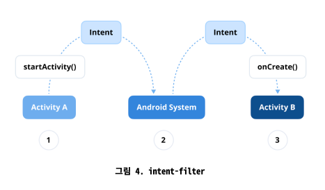

# Q) 1. 인텐트(Intent)란 무엇인가요?
Intent는 어플리케이션 간에 작업 수행을 위한 정보를 전달하는 꾸러미입니다. `Activity`, `Service`,
`BroadcastReceiver`가 통신할 수 있도록  하는 메시징 객체입니다.
일반적으로 `Activity` 시작 시 사용되고, `Broadcast`나 `Service`시작 시에도 사용됩니다.

### 1. 명시적 Intent (Explicit Intent)
- 정의: 명시적 Intent는 호출할 컴포넌트(Activity or Service)를 직접 이름으로 지정하여 정확히 명시합니다.
- 사용 사례: 대상 컴포넌트를 알고 있을때 사용됩니다. (앱 내 특정 Activity 시작시)
- 시나리오: 앱 내에 한 Activity 에서 다른 Activity 로 전환하는 경우
- 예시:
    ```kotlin
    val intent = Intent(this, TargetActivity::class.java)
    startActivity(intent)
    ```

### 2. 암시적 Intent (Implicit Intent)
- 정의: 암시적 Intent 는 특정 컴포넌트를 지정하지 않고 수행할 작업을 선언합니다.
시스템에서 액션(action), 카테고리(category), 데이터(data)를 기반으로
어떤 컴포넌트가 Intent를 처리할 수 있는지 결정합니다.
- 사용 사례: 다른 앱이나 시스템 컴포넌트에서 처리할 수 있는 작업을 수행할때 사용됩니다. (URL 열기 or 콘텐츠 공유)
- 시나리오: 브라우저에서 웹을 열거나 다른 앱과 콘텐츠를 공유하려는 경우
- 예시:
    ```kotlin
    val intent = Intent(Intent.ACTION_VIEW)
    intent.data = Uri.parse("https://www.example.com")
    startActivity(intent)
    ```
  
### 인텐트 필터 (Intent Filters)
안드로이드의 intent filter는  다른 앱의 매니페스트 파일에 선언된 인텐트 필터와 비교하여
시작할 적절한 구성요소를 찾습니다. <br/>
인텐트가 인텐트 필터와 일치하면 시스템은 해당 구성요소를 시작하고 Intent 객체를 전달합니다.<br/>
`AndroidManifest.xml` 파일에 정의되어 사용되며, Intent 에 해당하는 설정인 `action`, `category`, `data type` 을 포함할 수 있습니다.

<div align="center">


</div>

### 실전 질문
Q) 명시적 인텐트와 암시적 인텐트의 차이점은 무엇이며, 각각 어떤
시나리오에서 사용해야 하나요?

차이점: **호출할 대상을 직접 지정하는지 여부**<br/>
명시적 인텐트는 호출할 대상 컴포넌트를 알고 있을때 앱 내부에서 사용.<br/>
암시적 인텐트는 특정 컴포넌트를 지정하지 않고 다른 앱과 연동이나 기능 호출시 사용.

Q) 안드로이드 시스템은 암시적 인텐트를 처리할 앱을 어떻게 결정하며,
적합한 애플리케이션을 찾지 못하면 어떻게 되나요?

`AndroidManifest.xml` 에 적용되어 있는 인텐트 필터에 정의 되어 있는
액션, 카테고리, 데이터 타입을 확인하고, 이를 처리할 적합한 애플리케이션을 찾지 못하면
[`ActivityNotFoundException`](https://developer.android.com/reference/android/content/ActivityNotFoundException) 예외가 발생한다. 따라서 이를 처리해주는 추가적인 로직을 구현해주어야한다.
