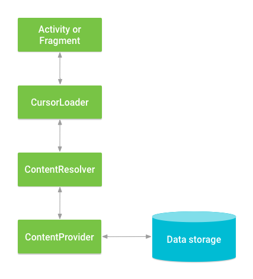

# Q) 11. ContentProvider의 목적은 무엇이며, 애플리케이션 간의 안전한 데이터 공유를 어떻게 용이하게 하나요?

ContentProvider는 데이터에 대한 추상화 계층을 제공하고, 다른 애플리케이션과 데이터를 공유하고 관리할 수 있도록 합니다.

### ContentProvider의 목적
외부 애플리케이션과의 데이터를 공유할때, 데이터 접근 로직을 캡슐화하여 앱 간
데이터 공유를 더 쉽고 안전하게 합니다.

### ContentProvider의 주요 구성 요소
ContentProvider 에서 데이터를 접근하기 위해 URI(Uniform Resource Identifier) 를 사용합니다.

URI 구성 요소
> 형식 
> `content://authority/path/id`
1. 권한(Authority): ContentProvider 를 식별합니다. (ex. com.example.myapp.provider)
2. Path: 데이터 유형을 지정합니다.
3. ID(optional): 데이터 셋 내의 특정 항목을 참조합니다.

### ContentResolver와의 상호작용
앱은 ContentResolver를 통해 ContentProvider와 통신합니다.

ContentResolver는 데이터 조작을 위한 표준 메서드를 제공합니다:
- query() : 데이터 조회
- insert() : 데이터 삽입
- update() : 데이터 수정
- delete() : 데이터 삭제

Provider 객체와 통신하여 Provider 객체는 데이터 요청을 받고 결과를 반환합니다.

### ContentProvider 사용 사례
- 다른 애플리케이션 간 데이터 공유.
- 앱 시작 시 컴포넌트 또는 리소스 초기화.
- 연락처, 미디어 파일 또는 앱별 데이터와 같은 구조화된 데이터에 대한 접근 제공.
- 연락처 앱이나 파일 선택기와 같은 안드로이드 시스템 기능과의 통합 활성화.
- 세분화된 보안 제어를 통한 데이터 접근 허용.

    
앱 시작 시 리소스나 초기 셋업을 위해 ContentProvider를 사용하는 사용 사례

    // 추후 작성 예정

### 실전 질문
Q) ContentProvider URI 의 주요 구성 요소는 무엇이며,
`ContentResolver` 는 데이터를 쿼리하거나 수정하기 위해 `ContentProvider`와 어떻게 상호 작용하나요?

URI는 `Authority`, `Path`, `ID`로 구성되며, 각각 ContentProvider 식별자, 데이터 유형, 특정 데이터 항목을 의미합니다.
앱은 직접 ContentProvider에 접근하지 않고, ContentResolver를 통해 `query()`, `insert()`, `update()`, `delete()` 메서드를 호출하여 데이터를 안전하게 요청하거나 수정합니다.