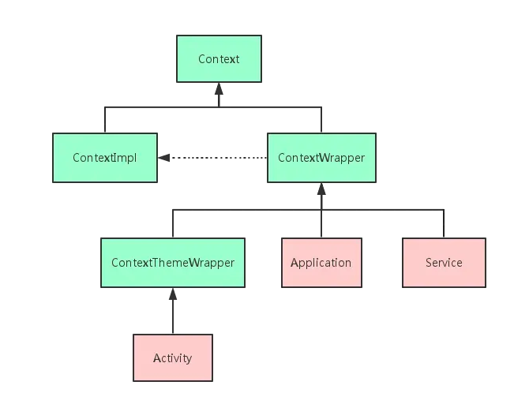

# Q) 4. Context란 무엇이며 어떤 유형의 Context가 있나요?
Context는 애플리케이션 환경 또는 상태에 대한 전역 정보를 접근하기 위한 인터페이스입니다.
abstract 클래스이며 실제 구현은 안드로이드 시스템에 의해 구현됩니다.
애플리케이션별 리소스와 클래스에 대한 접근을 제공합니다.

> Context는 어플리케이션과 관련되 정보에 접근하고자 하거나 어플리케이션과 연관된 시스템 레벨의 함수를 호출하고자 할 때 사용됩니다.

## Context 유형
Android 에서 Context는 컴포넌트(Activity, Service, Application 등)가 생성될 때 함께 구성되며,
각 컴포넌트는 자신만의 Context 객체를 가집니다.
따라서 애플리케이션 내 모든 컴포넌트가 동일한 Context를 공유하지 않고,
역할과 생명주기에 따라 다른 종류의 Context(Application Context, Activity Context 등)를 사용하게 됩니다.

### Application Context
Application context는 애플리케이션의 생명주기를 따릅니다.
주로 독립적이면서 전역적으로 오래 지속되는 Context 가 필요할 때 사용됩니다.
`getApplicationContext()` 를 호출해 사용할 수 있습니다.

#### Application Context 사용사례
- `SharedPreferences`나 데이터베이스와 같은 애플리케이션 전체 리소스에 접근하는 경우.
- 전체 앱 생명주기 동안 지속되어야 하는 `BroadcastReceiver`를 등록 하는 경우.
- 앱 생명주기 동안 유지되는 라이브러리나 컴포넌트를 초기화하는 경우

### Activity Context
Activity context는 Activity 의 생명주기를 따릅니다.<br/>
Activity 에 특정한 리소스 접근, 다른 Activity 시작, 레이아웃 인플레이션에 사용됩니다.

#### Activity Context 사용사례
- UI 컴포넌트를 생성 또는 업데이트하는 경우(layout inflate)
- 다른 Activity를 실행하는 경우
- 현재 Activity 범위에 있는 리소스나 테마에 접근하는 경우

### Service Context
Service의 생명주기를 따릅니다. 주로 네트워크 작업 수행 및 음악 재생과 같은
백그라운드에서 실행되는 작업에 사용됩니다. 해당 context는 UI 작업시에는 사용 불가합니다.

### Broadcast Context
BroadcastReceiver 가 호출될 때 제공됩니다. 짧은 시간 동안 특정 브로드캐스트에 응답하는데 사용됩니다.<br/>
메모리 누수 등의 이유로 장시간 태스크를 사용해서는 안됩니다.
`onReceive()`메소드에서만 유효합니다. 

### ContentProvider Context
데이터베이스를 관리할 때 주로 사용되며, 다른 앱과 데이터를 공유할 수 있습니다.

### Context 사용시 주의할 점
1. Context 가 유지 되는 생명주기보다 오래 참조를 유지하는 경우<br/>
대표적으로 ViewModel 에서의 context 사용시 어떻게 사용할 수 있는지 알아보겠습니다.
   - AndroidViewModel을 상속하여 ApplicationContext 를 사용하는 방법
     ```kotlin
     class MyViewModel(application: Application) : AndroidViewModel(application) {
          
          // Application Context를 가져와서 사용
          private val context: Context = getApplication<Application>().applicationContext
     
          fun doSomethingWithContext() {        
              // Application Context 사용 
              val sharedPreferences = context.getSharedPreferences("prefs", Context.MODE_PRIVATE)
         }
     }
     ```
   - Context 를 전달받아 필요한 경우에만 사용하는 방법<br/> 해당 방식은 Context 를 유지하지 않고 필요한 순간에만 사용됩니다.
       ```kotlin
       class MyViewModel : ViewModel() {
    
            fun performActionWithContext(context: Context) {
                // 필요한 순간에만 Context 사용
                val sharedPreferences = context.getSharedPreferences("prefs", Context.MODE_PRIVATE)
            }
       }
        ```
   - Repository 패턴을 사용하는 방법<br/>ViewModel과 Context 관련 작업에 대한 의존성을 분리할 수 있습니다.
       ```kotlin
        class MyRepository(private val context: Context) {
            fun saveDataToPreferences(data: String) {
                val sharedPreferences = context.getSharedPreferences("prefs", Context.MODE_PRIVATE)
                sharedPreferences.edit().putString("key", data).apply()
            }
        }
     
        class MyViewModel(private val repository: MyRepository) : ViewModel() {
            fun saveData(data: String) {
                repository.saveDataToPreferences(data)
            }
        }
       ```
2. 적절한 유형의 Context 사용
- 레이아웃 인플레이션이나 다이얼로그 표시와 같은 UI 관련 작업
   에는 Activity Context를 사용하는 것이 적합합니다.
- 라이브러리 초기화와 같이 UI 생명주기와 독립적인 작업에는
   Application Context를 사용하는 것이 적합합니다.
3. 백그라운드 스레드에서 Context 사용 피하기<br/>
UI 업데이트와 같은 경우 메인스레드에서 작업을 수행해야합니다. 백그라운드 스레드에서 작업하는 도중 UI 관련
Context 를 사용하게 된다면, 반드시 메인 스레드로 전환해야합니다.
   ```kotlin
    viewModelScope.launch {
        val data = fetchData()
        // UI 업데이트는 메인 스레드에서 수행해야 합니다.
        withContext(Dispatchers.Main) {
            Toast.makeText(context, "Data fetched", Toast.LENGTH_SHORT).show()
        }
    }
    ```
<details>
     <summary>ContextWrapper란?</summary>



ContextWrapper 는 Context 를 상속받고 있는 래퍼 클래스로, Context 에 대한 호출을 위임하는 기능을 제공합니다.<br/>
이는 원본 Context의 동작을 수정하거나 확장하기 위한 중간 계층 역할을 합니다.

사용 사례
1. 커스텀 컨텍스트: 앱 전체에 다른 테마를 적용하거나 리소스를
   특수한 방식으로 처리하는 등 특정 목적을 위한 커스텀 Context를
   생성해야 하는 경우.
2. 동적 리소스 처리: 문자열, 치수(dimension) 또는 스타일(style)
   과 같은 리소스를 동적으로 제공하거나 수정하기 위해 Context를
   래핑하는 경우.
3. 의존성 주입: Dagger나 Hilt와 같은 라이브러리는 의존성 주입
   을 위해 커스텀 ContextWrapper를 생성하고13, 컴포넌트에 해당
   ContextWrapper를 Context 타입으로 제공합니다.
    
</details>

### 실전 질문
Q) 안드로이드 애플리케이션에서 올바른 유형의 Context를 사용하는
것이 왜 중요하며, Activity Context에 대해 오랜 참조를 유지하는
것은 잠재적으로 어떤 문제를 발생시킬 수 있나요?

메모리 누수와 같은 문제가 일어날 수 있습니다.<br/>
대표적으로 Activity 혹은 Fragment Context 에 대한 참조를 해당 생명주기 보다 오래 유지하는 경우,<br/>
GC 에서 Context 또는 관련 리소스에 대한 메모리를 회수할 수 없게 되어 메모리 누수가 일어날 수 있습니다.<br/>
이런 경우에는 Application Context 를 사용해야합니다.

## 📕 참고 링크
**다음의 링크를 참고했습니다.**

https://jinudmjournal.tistory.com/241