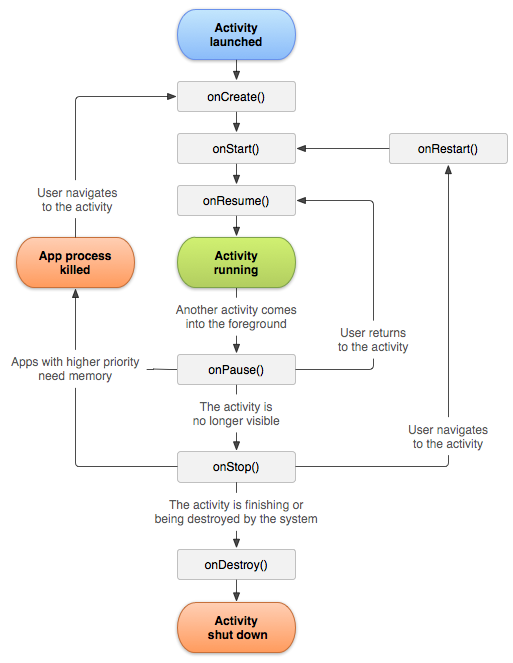

# Q) 7. Activity 생명주기를 설명해주세요



#### 1. onCreate():<br/>
Activity 가 생성될 때 호출되는 메서드로 Activity 초기화, UI 컴포넌트 구성, 저장된 인스턴스(savedInstanceState) 복원을 수행합니다.<br/> 
Activity 가 소멸되고 재성성 되지 않는한 Activity의 생명주기 동안 단 한번만 호출됩니다.<br/>
실행완료시 `onStart()` 를 호출합니다.
#### 2. onStart():<br/>
Activity가 사용자에게 보이지만 아직 상호 작용할 수는 없습니다.
앱은 Activity를 포그라운드로 보내 상호작용할 수 있도록 준비합니다.
#### 3. onRestart():<br/>
Activity가 중지되었다가 다시 시작되는 경우, 이 메서드가 `onStart()` 전에 호출 됩니다.
#### 4. onResume():<br/>
Activity가 포그라운 상태가 됩니다. 사용자와 상호작용 할 수 있습니다.<br/>
일시 중지된 UI 업데이트(카메라 미리보기 등), 애니메이션 또는 입력 리스너를 재개합니다.
#### 5. onPause():<br/>
다른 Activity(다이얼로그 등)에 의해 Activity 가 부분적으로 가려질 때 호출됩니다.<br/>
애니메이션, 센서 업데이트 또는 데이터 저장과 같은 작업을 일시 중지하는 데 사용됩니다.<br/>
이 상태에서, 데이터를 저장하거나, 네트워크 호출, DB의 IO 작업과 같은 무거운 작업을 하면 안됩니다.
#### 6. onStop():<br/>
Activity가 사용자에게 보이지 않을 때 호출됩니다. 백그라운드 작업, 카메라 작업과 같은 필요하지 않는 리소스를 제거합니다.
#### 7. onDestroy():<br/>
Activity가 완전히 소멸되고 메모리에서 제거되기 전에 호출됩니다. 남아 있는 모든 리소스를 해제하기 위한 최종
메서드입니다.

### Activity lifecycle 인스턴스란?
ComponentActivity의 하위 클래스에서 노출하는 Lifecycle 클래스의 인스턴스입니다.
생명주기 이벤 트를 해당 메서드를 직접 재정의하지 않고 관찰하는 방법을 제공합니다.
이를 통해 UI 업데이트, 리소스 해제 또는 LiveData를 구독하는데 유용합니다.

#### Lifecycle 인스턴스 사용 방법
`DefaultLifecycleObserver` 또는 `LifecycleEventObserver` 를 사용해 생명주기 이벤트를 알림받습니다.
```kotlin
class MyObserver : DefaultLifecycleObserver {
    override fun onStart(owner: LifecycleOwner) {
        super.onStart(owner)
        // onStart 시 수행할 작업 
    }

    override fun onStop(owner: LifecycleOwner) {
        super.onStop(owner)
        // onStop 시 수행할 작업
    }
}

class MainActivity : ComponentActivity() { 
    override fun onCreate(savedInstanceState: Bundle?) {
        super.onCreate(savedInstanceState)
        lifecycle.addObserver(MyObserver())     
    }
}
```
다음과 같이 직접 오버라이드하여 구현하는 방식보다 생명주기 관찰과 관련된 로직을 Activity 클래스
외부로 이동하여 가독성과 유지 관리를 향상시킬 수 있습니다.

### 실전 질문
Q) onPause()와 onStop()의 차이점은 무엇인지 설명하고, 리소스 점유율이
높은 작업을 처리하는 경우 해당 메서드들을 어떤 시나리오에서 사용해야 하나요?

`onPause()`는 Activity가 부분적으로 가려질 때 호출되어 **즉시 해제해야 하는 리소스(카메라, 센서, 애니메이션 등)** 를 다루고,
`onStop()`은 Activity가 화면에서 완전히 사라졌을 때 호출되어 **비교적 무거운 리소스(DB 연결, 네트워크 등)** 를 해제하는 데 사용합니다.

## 📕 참고 링크
**다음의 링크를 참고했습니다.**

https://developer.android.com/guide/components/activities/activity-lifecycle?hl=ko