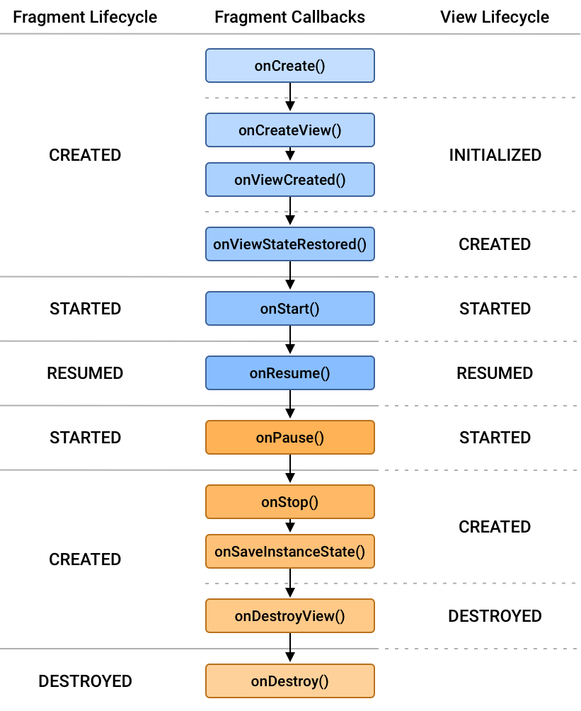

# Q) 8. Fragment 생명주기를 설명해주세요
Fragment 인스턴스는 연결된 부모 Activity의 생명주기와 별도로 자체적인 생명주기를 갖습니다.



<br/>**1. onAttach():**<br/>
Fragment가 부모 Activity와 연결 될 떄 호출 되는 첫 번째 콜백 메소드.
인자로 Context 가 주어집니다.
<br/><br/>**2. onCreate():**<br/>
Fragment 를 초기화하기 위해 호출됩니다. UI 는 아직 생성되지 않습니다.<br/>
필수 컴포넌트를 초기화하거나 액티비티로 부터 Bundle 데이터를 받아 저장된 상태를 복원합니다.
<br/><br/>**3. onCreateView():**<br/>
Fragment의 UI 가 처음으로 그려질 때 호출됩니다.<br/>
LayoutInflater 를 사용하여 Fragment 의 레이아웃을 인플레이션 합니다.
<br/><br/>**4. onViewCreated():**<br/>
Fragment 의 뷰가 생성된 후에 호출 됩니다.<br/>
Lifecycle 의 상태가 `INITIALIZED` 상태가 됩니다.
View의 초기값 설정, LiveData 옵저빙, Adapter 세팅을 해당 메소드에서 주로 합니다.
<br/><br/>**5. onViewStateRestored():**<br/>
저장된 상태가 복원 된 후 호출 됩니다.
Lifecycle 의 상태가 `CREATED` 상태가 됩니다.
<br/><br/>**6. onStart():**<br/>
Fragment가 사용자에게 보이게 됩니다.
Activity 의 `onStart()` 콜백과 유사하게 동작합니다.
<br/><br/>**7. onResume():**<br/>
Fragment 가 상호작용할 수 있는 상태로, 모든 Animation 과 Transition 효과가 종료된 상태입니다.
<br/><br/>**8. onPause():<br/>**
Lifecycle 의 상태가 다시 `STARTED` 상태가 됩니다.
Fragment 가 포그라운드에 없지만 여전히 화면에 보이는 경우 호출됩니다.
Fragment가 포그라운드에 없을 때 지속해서는 안 되는 작업을
일시 중지해야 합니다.
<br/><br/>**9. onStop():**<br/>
Fragment 가 더 이상 보이지 않습니다. Fragment 가 화면 밖에 있는동안 지속할 필요가 없는 작업을 중지합니다.
API 28버전을 기점으로 `onSaveInstanceState()` 함수와 `onStop()` 함수 호출 순서가 달라져,
`onStop()`이 `FragmentTransaction`을 안전하게 수행하는 마지막 지점입니다.
<br/><br/>**10. onSaveInstanceState():**<br/>
Fragment 가 소멸되기 전에 UI 관련 상태 데이터를 저장하여 나중에 복원할 수 있도록 합니다.
<br/><br/>**11. onDestroyView():**<br/>
모든 exit animation, transaction이 완료되고 Fragment가 화면으로부터 벗어났을 경우 호출됩니다.<br/>
`onViewCreated()` 에서 했던 참조를 null 로 만드는 등의 리소스를 정리해야합니다.
<br/><br/>**12. onDestroy():**<br/>
Fragment 자체가 소멸될 때 호출됩니다. 이 시점에서 모든 리소스를 정리해야 
하지만 Fragment는 여전히 부모 Activity에 연결되어 있습니다.
<br/><br/>**13. onDetach():**<br/>
Fragment가 부모 Activity에서 분리되어 더 이상 연결 되지 않습니다. 
마지막 콜백으로 Fragment의 생명주기가 완료됩니다.

<details>
    <summary>fragmentManager 와 childFragment 의 차이점</summary>

#### fragmentManager
프래그먼트에서 프래그먼트를 추가, 삭제, 또는 교체하고 백 스택에 추가하는 등의 작업을 실행하는 클래스

호스트 액티비티(FragmentActivity)에서 프래그먼트 관리자 클래스를 구현하여 `supportFragmentManager`를 통해
프래그먼트 관리자를 인스턴스화 및 호출할 수 있습니다.
일반적으로 Activity에서 주요한 역할을 하는 내비게이션 시스템이나 UI 일부를 담당하는 Fragment를 컨트롤하는데 사용됩니다.

#### childFragmentManager
하나의 Fragment에 속하며 해당 Fragment의 자식 Fragment를 관리합니다.
Fragment가 다른 Fragment를 호스팅하여 중첩된 Fragment 구조를 만들 수 있습니다.

부모 Fragment 의 생명주기 내에서 정의 되기 때문에, 부모 Fragment 소멸시 자식 Fragment 도 소멸됩니다.

단순 UI Fragment 구현시에는 fragmentManager 를 사용하고 중첩 Fragment 나 모듈화된 컴포넌트 구성시에
childFragmentManager를 사용합니다.
</details>


### viewLifecycleOwner
Fragment 의 뷰 계층과 관련된 LifecycleOwner 입니다.
Fragment 에서의 lifecycle 이외에 뷰계층 단위의 lifecycle 을 가지는데 이를 뷰계층 lifecycle 입니다. <br/>
이는 Fragment의 `onCreateView` 가 호출 되고, `onDestroyView` 가 끝날때 Fragment 뷰의 생명주기를 나타냅니다.

기존의 Fragment lifecycle 사용시에는 뷰가 소멸된 후에도 여전히 뷰에 접근할 위험성이 있으나,
viewLifecycleOwner를 사용하면 관찰자나 생명주기 인식 컴포넌트가 뷰의
생명주기에 연결되어 뷰가 소멸될 때 업데이트를 안전하게 중지할 수 있습니다.
```kotlin
class FragmentB : Fragment() {
    private val model: SharedViewModel by activityViewModels()

    override fun onViewCreated(view: View, savedInstanceState: Bundle?) {
        super.onViewCreated(view, savedInstanceState)

        viewLifecycleOwner.lifecycleScope.launch {
            repeatOnLifecycle(Lifecycle.State.STARTED) {
                model.selected.collect { value ->
                    binding.textView.text = value
                }
            }
        }
    }
}
```
lifecycle 의 상태에 따라서 맞추어 재개할 수 있어 불필요한 메모리 누수나 리소스 방지를 할 수 있습니다.

#### lifecycleOwner와 viewLifecycleOwner의 차이점
- lifecycleOwner (Fragment의 생명주기): Fragment의 전체 생명주기를
나타내며 상대적으로 생명주기가 더 길고, 호스팅 Activity에 연결됩니다.
- viewLifecycleOwner (Fragment 뷰의 생명주기): Fragment 뷰의 생명주기를 나타내며,
- onCreateView에서 시작하여 onDestroyView에서 종료됩니다. 주로 LiveData 와 같이 UI 관련 작업에서 사용됩니다.

### 실전 질문
Q) onCreateView()와 onDestroyView()의 목적은 무엇이며, 해당 메서드에서
뷰 관련 리소스를 올바르게 처리하는 것이 왜 중요한가요?

## 📕 참고 링크
**다음의 링크를 참고했습니다.**

https://developer.android.com/guide/fragments/lifecycle?hl=ko