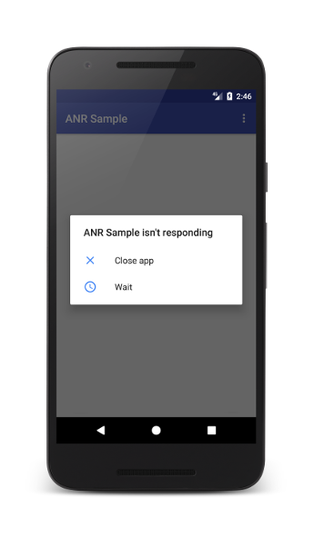

# Q) 14. ANR 이란 무엇인지, ANR이 발생하는 주요 원인은 무엇이며, 어떻게 예방할 수 있는지 설명해주세요.

ANR(Application Not Responding) 은 앱의 메인 스레드(UI 스레드)가 너무 오랫동안,
통상적으로 5초 이상 차단(blocking)될 때 발생하는 안드로이드 시스템 오류입니다. 

ANR 발생 요인
- 메인 스레드에서 5초 이상 걸리는 무거운 작업
- 장시간 실행되는 네트워크 또는 데이터베이스의 등의 I/O 작업
- UI 스레드 차단 작업 (ex. UI 스레드에서의 동기 작업)

그밖에 ANR 트리거

입력 전달 타임아웃: 앱이 입력 이벤트(예: 키 누름 또는 화면 터치)에 5초 이내에 응답하지 않은 경우

서비스 실행: 앱에서 선언한 서비스가 몇 초 이내에 `Service.onCreate()` 및 `Service.onStartCommand()`/`Service.onBind()` 실행을 완료할 수 없는 경우 

`Service.startForeground()` 가 호출되지 않음: 앱이 `Context.startForegroundService()` 를 사용하여 포그라운드에서 새 서비스를 시작했지만 서비스가 5초 내에 `startForeground()`를 호출하지 않은 경우 

인텐트 브로드캐스트: `BroadcastReceiver`가 설정된 시간 내에 실행을 완료하지 못한 경우. 앱에 포그라운드 활동이 있는 경우 이 제한 시간은 5초입니다. 

JobScheduler 상호작용: `JobService`가 몇 초 이내에 `JobService.onStartJob()` 또는 `JobService.onStopJob()`에서 반환되지 않거나 사용자 시작 작업이 시작되고 `JobService.onStartJob()` 이 호출된 후 몇 초 이내에 앱이 `JobService.setNotification()` 을 호출하지 않는 경우.

### ANR 예방 방법
1. 무거운 작업을 메인 스레드 밖으로 이동: 
파일 I/O, 네트워크 요청 또는 데이터 베이스 쿼리와 같은 작업을 처리하기 위해 백그라운드 스레드를 사용합니다. 
안전한 접근 방식으로 처리한다면 Kotlin Coroutines 의 `Dispatchers.IO` 를 활용합니다.

2. WorkManager 사용: 
데이터 동기화와 같이 백그라운드에서 실행되어야 하는 장기적인 작업에서 `WorkManager` 를 사용합니다.
이는 메인 스레드 외부에서 실행됩니다.

3. 데이터 불러오기 최적화: 
대규모 데이터를 데이터베이스나 네트워크에서 한 번에 불러와 UI 에 표시하는 작업은
상당한 시간이 소요 될 수 있기에, 페이징(Paging) 을 사용해 당장 화면에 보여줄 적은 양의 데이터만
불러와 메인 스레드가 빠르게 작업을 마치고 사용자 입력에 응답할 수 있습니다.

4. 구성 변경 시 UI 작업 최소화: 
ViewModel 을 활용해 UI 관련 데이터를 유지하고 불필요한 데이터 요청 시간을 줄일 수 있습니다.

5. Android Studio 로 모니터링 및 프로파일링: 
Android Studio Profiler 도구를 활용해, CPU, 메모리 및 네트워크 사용량을 모니터링합니다. 
ANR 을 유발할 수 있는 성능 병목 현상을 식별할 수 있습니다.

6. 블로킹(bloking) 호출 피하기: 
원활한 앱 성능 보장을 위해 메인 스레드에서 긴 루프, sleep 호출 혹은 네트워크 요청을 동기로
수행하여 UI 스레드를 블로킹하는 작업을 수행하지 않습니다.

7. 가벼운 지연 작업에 Handler 사용: 
메인스레드에서 `Thread.sleep()` 는 메인 스레드를 지정된 시간 동안 정지시키기에 UI 상호작용을 불가능하게 만듭니다.
따라서 가벼운 지연의 경우에는 `Handler.postDelayed()` 와 같이 메시지 큐에 예약을 거는 방식으로 메인스레드를 
차단하지 않고 지연을 처리합니다. 
또는, 작업 스레드에서 코루틴 `delay()` 함수를 사용해 처리합니다.

### 실전 질문
Q) ANR을 진단하고 앱 성능과 유저 경험을 개선해보신 경험이 있으신가요?