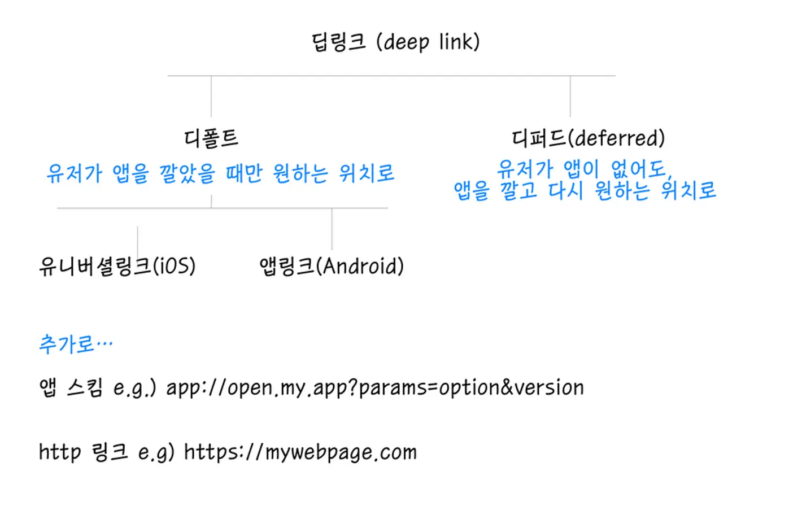

# Q) 15. 딥 링크(deep links)를 어떻게 처리하는지 설명해주세요.

딥링크는 사용자가 URL 이나 알림과 같은 외부 소스에서 앱 내 특정 화면이나
기능으로 직접 이동할 수 있도록 합니다.<br/>
딥링크를 사용하면 매끄러운 유저 경험을 제공하여 전환율과 리텐션을 높일 수 있습니다.

### 딥링크 유형
<div align="center">


</div>

1. URI Scheme<br/>
딥링크의 가장 초기 형태로, 앱 내 특정 페이지 마다 고유한 주소를 설정하여, 특정 페이지가 열리는 형태
<br/><br/>
모바일 앱은 자신만의 Scheme 을 등록하여 사용합니다.

다만, 해당 방식에는 앱의 수가 증가하면서, Scheme 값이 중복되는 경우가 발생했습니다.<br/>
이는 소유권을 증명하지 못해서 생기는 문제입니다.

2. App Links(Android)
이를 해결하기 위해서 앱에 대한 도메인 주소를 등록함으로써 소유권을 증명하는 방식으로 해결했습니다.<br/>
헤당 검증된 도메인으로 생성된 딥링크 클릭시,<br/>
앱이 설치된 경우 앱 및 특정 페이지가 열리고, 앱이 설치되지 않는 경우,
해당 도메인의 웹페이지로 이동합니다.(혹은 앱  마켓으로 이동)

참고로 해당 방식은 iOS 에서도 Universal Link 로 지원하고 있습니다.

하지만 모든 앱에서 앱 링크와 유니버셜 링크 오픈을 지원하지 않습니다. 예를 들어 각 OS 브라우저인
Android 는 Chrome, iOS 는 Safari 만을 동작하도록 설정되어 있습니다.<br/>
OS 에 맞지 않는 브라우저를 사용시에는 정상적으로 동작하지 않는 이슈가 있습니다.
또한, 앱 미설치로 인한 앱 스토어 이동시에 쿼리 파라미터 정보가 포함된 Url 을 잃게 됩니다.<br/>
이를 해결하기 위한 방식으로 deferred deep link 를 사용합니다.
대표적으로, 앱스플라이어의 OneLink, 파이어 배이스의 Dynamic Link 가 있습니다.

3. Firebase Dynamic link
이미 앱을 설치한 사용자라면 앱을 실행시키고 사용자가 앱이 설치되어 있지 않다면,
안드로이드인지 아이폰인지 구분해 해당 마켓으로 보내주는 역할을 합니다.
또한, 앱 설치 이후에 플로우를 연결 시킬 수 있는 등 여러 이점이 있습니다.


### 딥링크 설정 방법
1. AndroidManifest.xml 파일에 딥링크 정의
Activity 내부에 `intent-filter` 를 선언하고 해당 자리에 URL 구조 혹은 스키마(Scheme) 를 지정합니다.
```xml
<activity android:name=".MyDeepLinkActivity" 
          android:exported="true">
    <intent‑filter>
        <action android:name="android.intent.action.VIEW" />
        <category android:name="android.intent.category.DEFAULT" />
        <category android:name="android.intent.category.BROWSABLE" />
        <!‑‑ 딥 링크 URI 정의 ‑‑>
        <data
            android:scheme="https"
            android:host="example.com"
            android:pathPrefix="/deepLink" />
    </intent‑filter>
</activity>
```

2. Activity 딥링크 처리
Activity 내부에서 Intent 데이터를 검색해 처리하여 적절한 화면으로 이동합니다.
```kotlin
class MyDeepLinkActivity : AppCompatActivity() {

    override fun onCreate(savedInstanceState: Bundle?) {
        super.onCreate(savedInstanceState)
        setContentView(R.layout.activity_my_deep_link)
    
        // Intent 데이터 가져오기
        val intentData: Uri? = intent?.data
        if (intentData != null) {
            // 쿼리 파라미터 검색 예시
            val id = intentData.getQueryParameter("id")
            navigateToFeature(id)
        }
    }

    private fun navigateToFeature(id: String?) {
      // 딥 링크 데이터를 기반으로 특정 화면으로 이동
        if (id != null) {
            // TODO: 실제 내비게이션 또는 작업 수행
            // navigate(..) or doSomething(..)
        }
    }
}
```


### 실전 질문
Q) 안드로이드에서 딥 링크를 어떻게 테스트하고, 다양한 기기와 시나리오에서
올바르게 작동하는지 확인하기 위해 사용하는 디버깅 기법이 있다면 설명해 주세요.