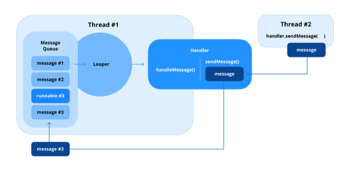

# Q) 23. Looper, Handler, HandlerThread의 역할은 무엇인가요?


<div align="center">


</div>

### Main Thread

Looper, Handler, HandlerThread 를 보기전에 안드로이드의 쓰레드의 동작에 대해 잠깐보자면,
안드로이드에서 흔히 말하는 `메인 쓰레드`는 `UI 쓰레드`로 UI 처리시에 하나의 쓰레드 모델로 동작합니다.

기본적으로 싱글 쓰레드로 동작을 하는 이유는 여러 쓰레드에서 값을 변경하는 상황이 발생할경우,
사용자에게 보여지는 화면에서 어떠한 결과가 나올지 예측하기 어렵기 때문에 이는 무결성을 깨뜨립니다.
따라서 다른 쓰레드에서 UI 를 변경할 수 없으며, 메인 쓰레드는 UI 관련 작업만을 수행해야합니다.

따라서 메인 쓰레드에서 서버 통신과 같은 시간이 오래 걸리는 동작의 경우,
별도의 쓰레드에서 작업을 하고 결과를 받으면 이를 업데이트 하는 방식으로 구현합니다.

이를 도와주는 컴포넌트가 Looper 와 Handler 입니다. 이를 사용하면 멀티 쓰레드 환경을 구축하여,
메인 스레드와 상호작용 할 수 있습니다.

### Looper
스레드를 유지하여 메시지 또는 작업 큐를 순차적으로 처리하는 안드로이드 스레딩 모델의 일부

하나의 쓰레드에는 오직 하나의 Looper 를 가지며, Looper 는 오직 하나의 쓰레드를 담당합니다.
안드로이드에서는 `MainActivity`가 실행됨과 동시에 자동의로 메인 쓰레드의 Looper 가 실행됩니다.

내부에 **MessageQueue** 를 지속적으로 모니터링하고 메시지를 하나씩 꺼내 이를 **Handler** 로
전달하는 역할을 합니다.

> 여기서 `Message` 는 하나의 작업 단위 이고, `MessageQueue` 에는 
> 이러한 작은 작업 단위를 가지고 있다가, `Looper` 가 이를 차례로 처리하게 됩니다.

```kotlin
val thread = Thread {
    Looper.prepare()    // 스레드에 Looper 연결 초기화
    val handler = Handler(Looper.myLooper()!!)  // Handler 생성
    Looper.loop()       // 메시지 루프 시작 
}
thread.start()
```

### Handler
스레드의 MessageQueue 내에서 메시지나 작업을 보내고 처리하는데 사용

1. Looper 로 전달하는 경우<br/>
`Message` 객체를 생성하여 이를 전달하는 방식으로 구현
   - `sendMessage()` 메소드를 통해 `Message` 객체를 저장
   - `post` 메소드를 통해 `Runnable`객체를 직접 저장
2. Looper 로 메시지를 받는 경우<br/>
`Looper` 가 메세지 큐에서 메시지를 꺼낸 경우,
    - `Runnable` 객체 라면, 해당 `Runnable`의 `run()` 메소드를 호출
    - `Message` 객체 라면, 해당 `Handler`가 갖고 있는 `handleMessage()`
        메소드를 호출

> Runnable 이란?<br/>
> Message 를 전달하는 방식 대신 쓰레드에서 실행 가능한 코드 조각을 직접 전달하는 인터페이스

### HandlerThread
내장된 Looper 를 가진 Thread<br/>
작업 또는 메시지 큐를 처리할 수 있는 백그라운드 스레드를 생성하는 과정을 단순화한 버전

```kotlin
val handlerThread = HandlerThread("WorkerThread")
handlerThread.start() // 스레드 시작

val workerHandler = Handler(handlerThread.looper) // 해당 Looper를 사용하여 작업 처리

workerHandler.post {
  // 백그라운드 작업 수행
  Thread.sleep(1000)
  Log.d("HandlerThread", "Task completed")
}

// 스레드 종료
handlerThread.quitSafely() // 처리 중인 메시지 완료 후 안전하게 종료
```

### 정리
- Looper: 메인 스레드 또는 워커 스레드에서 연속적인 메시지 큐를 관리하는데 사용됩니다.
- Handler: 스레드 간 통신(ex. 백그라운드 스레드에서 UI 업데이트)에 주로 사용됩니다.
- HandlerThread: 데이터 처리나 네트워크 요청과 같이 전용 스레드가 필요한 백그라운드 작업에
  적합합니다.


### 실전 질문
Q) Handler는 Looper와 어떻게 작동하여 스레드 간 통신을 용이하게하며,
Handler의 일반적인 사용 사례를 말씀해주세요.

Handler 를 통해 Looper 에 Message 또는 Runnable 객체를 전달하여,
백그라운드 스레드에서 Message 를 전달해 UI 스레드에 업데이트 할 수 있습니다.

Q) HandlerThread란 무엇이며, Looper.prepare()를 사용하여 수동으로
스레드를 생성하는 것과 비교하여 백그라운드 스레드 관리를 어떻게 단순화하나요?

Looper 를 내부적으로 가지고 있어 수동으로 Looper 를 생성할 필요없이
작업을 바로 처리할 수 있습니다.