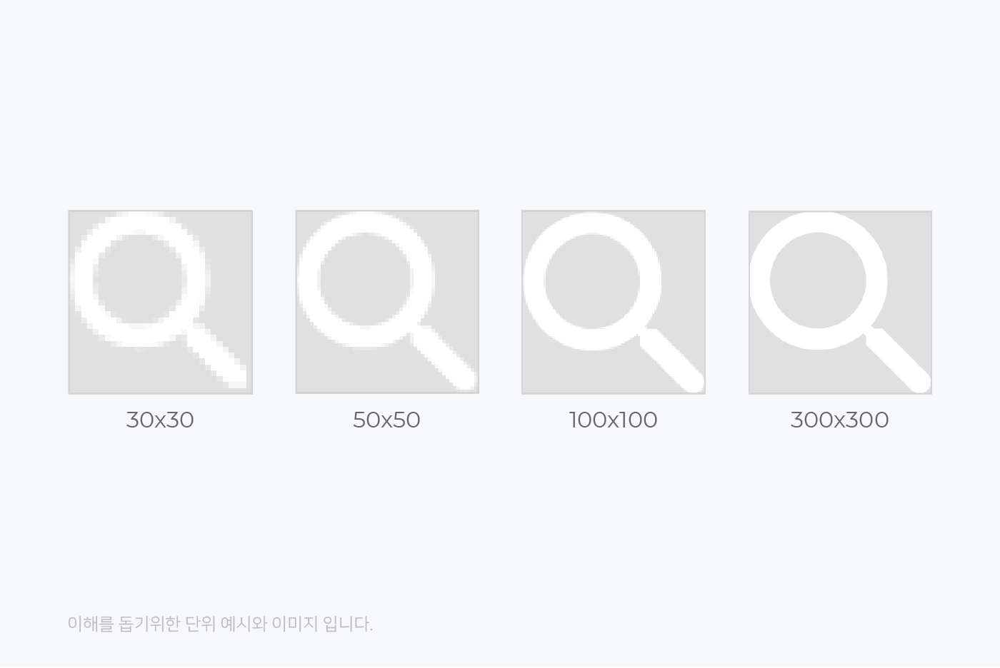
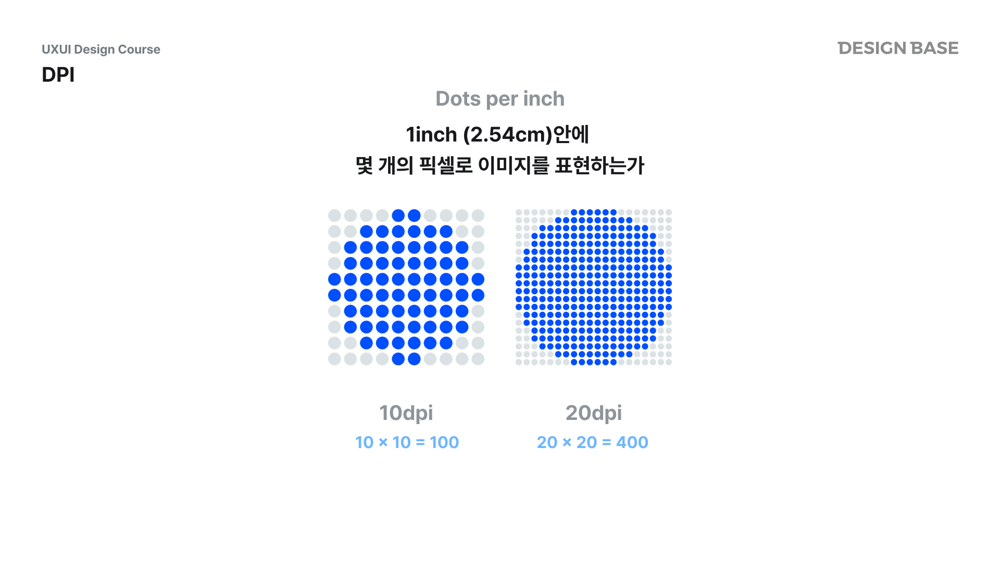
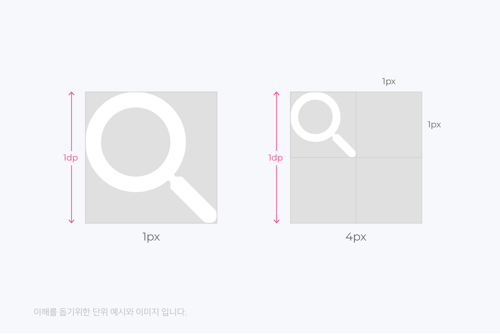
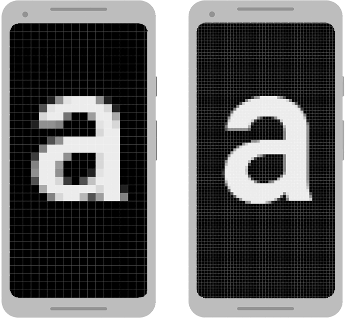

# Q) 42. Dp와 Sp의 차이점은 무엇인가요?

### 해상도
해상도는 스크린이나 종이 등의 표면에 표현되는 이미지 또는 문자의 세밀함을 나타내는 지표

### 픽셀(Picture Element)에 관한 이해
픽셀은 화면에서 이미지를 표현하는 가장 기본적 단위 
픽셀수가 많으면 고해상도, 적으면 저해상도

### DPI(Dots Per Inch)
1인치(2.54cm) 안에 포함된 픽셀수 

> 10 DPI = 10 pixel / 1 inch  --> 10 dpi 는 1인치안에 pixel 10개

 

DPI 가 높을 수록 이미지는 더 선명해집니다. 다만, 그만큼 메모리 용량은 더 커집니다.

*시청거리를 50~60cm정도에서 인접 픽셀이 구분되지 않을 정도로 선명하다고 느끼는 dpi는 185dpi 정도

### DP (Density-independent Pixels)
DP 는 패딩, 마진, 너비와 같은 UI 요소의 측정 단위

같은 화면에서 픽셀 밀도가 높을수록, 픽셀의 크기가 작아집니다.

그만큼 이와 같이 같은 픽셀이여도 크기가 달라지는 현상이 생깁니다.

따라서 dp(밀도 독립적 픽셀) 를 사용해
다양한 화면 밀도를 가진 기기에서 UI 컴포넌트의 일관된 물리적 크기를 제공하도록 설계

> 1 DP = 160 DPI (인치당 도트 수) 화면의 물리적 픽셀 1개
> px = dp * (dpi / 160)

기본적으로 인치당 160 픽셀(중밀도, mdpi)을 사용하지만,
일부, 다른 기기에서는 480 픽셀을 사용할 수 도 있습니다.

즉, 1인치에 160x160 픽셀이 있어 25,6000 개 픽셀로 표현

예를 들어 1dp는 약 160dpi(mdpi 기준)에서 1px에 해당합니다. 
- hdpi(240dpi)에서는 1dp = 1.5px
- xhdpi(320dpi)에서는 1dp = 2px
- xxhdpi(480dpi)에서는 1dp = 3px
- xxxhdpi(640dpi)에서는 1dp = 4px

기기마다 픽셀 밀도가 달라 Dp 를 자동으로 조절합니다.

동일한 100 픽셀 너비는 왼쪽 기기의 픽셀 크기가 더 크기떄문에 훨씬 더 크게 보입니다.
따라서 인치당 픽셀수인 Dp 를 사용해 계산합니다.

예를 들어, Button 100dp 로 지정했다고 했을때
저밀도와 고밀도 화면에서 동일한 크기로 표시되지만 이를 렌더링 하는 데 필요한 픽셀수는 다릅니다.

### SP (Scale-independent Pixels)
SP 는 텍스트 크기에만 사용 되며, Dp 와 유사하지만 사용자 글꼴 크기 환경 설정을 추가로 고려합니다.

화면 밀도와 접근성 설정 모두를 기반으로 텍스트 크기를 조절해 읽기 쉽고 접근 가능한 텍스트를 보장합니다.

예를 들어, TextView 를 16sp 로 설정하면 화면 밀도에 맞게 크기가 조정되고
시스템 글꼴 크기를 늘린 경우에도 조정됩니다.

Sp 사용시 발생하는 레이아웃 문제

너무 큰 글꼴 크기 지정시 UI 컴포넌트가 겹치거나 화면을 벗어나는 경우 문제가 발생합니다.
버튼이나, 레이블과 같은 제한된 공간에서의 레이아웃이 깨질수 있습니다.

해결 방안
1. 콘텐츠 적절히 감싸기 
기본적으로 텍스트 기반 컴포넌트(text, button) 은 wrap_content 로 설정합니다.

2. Text OverFlow 시 TextView 에 minLines 또는 maxLines 사용 
minLines 로 텍스트 글자 수를 제한하거나, 
maxLines 와 함께 ellipsize(compose 에서는 ellipsis) 를 적용해 처리합니다. => ... 으로 처리됩니다.  
Compose 에서는 overflow = TextOverflow. 속성으로 적용 가능합니다. 
Clip : 텍스트 영역이 범위를 넘어갔을 때 잘라서 보여주는 옵션, 기본 값 
Visible : 텍스트 영역이 범위를 넘어갔을 때 모두 보여주는 옵션 
Ellipsis : 텍스트 영역이 범위를 넘어갔을 때 "..." 처리하는 옵션, maxLines와 함께만 사용 가능 

3. 중요한 UI 컴포넌트에 고정 크기 사용 
일관된 크기가 필요한 경우 중요한 컴포넌트에는 Dp 사용을 하여 size 를 지정합니다.

4. 극단적인 글꼴 크기 테스트 
항상 기기 설정에서 사용할 수 있는 가장 큰 시스템 글꼴 크기로 앱을 테스트하기

5. 제약 조건을 사용해 동적 크기 조절
ConstraintLayout 을 사용해 컴포넌트 위치 지정 및 크기 조절에 유연하게 반영

6. Sp 대신 Dp 크기 사용
글꼴 크기에도 고정된 값을 사용하고자 한다면 사용 가능. but, 사용자 경험을 저해시킬수 있다.

결론: Dp 와 Sp 차이는
Dp 와 Sp 모두 화면 밀도에 따라 크기가 조절되지만,
Sp 는 모든 사용자가 텍스트를 접근 가능하고 읽을 수 있도록 보장하고, 사용자가 글꼴 크기 환경 설정을 변경시 이를 반영합니다.

번외) 안드로이드에서 왜 8dp 단위를 권장하는가

**픽셀 정렬 문제를 방지**하기 위해서 입니다.

* 화면 밀도에 따라 dp가 px로 변환될 때 소수점이 생기면
  렌더링 시 **모서리 블러링(흐릿함)** 이 생길 수 있습니다.
* 8은 2, 4의 배수를 모두 포함하기 때문에
  다양한 해상도 비율에서 **정수 단위로 변환되는 경우가 많습니다.**
* 결과적으로 8dp 단위로 디자인하면
  **dp → px 변환 시 깨짐 없는 정확한 렌더링**이 가능하고,
  그리드 시스템 유지에도 유리합니다.

---

#### 예시: 8dp 단위 그리드 시스템

| 구분       | 예시 크기            | 설명            |
| -------- | ---------------- | ------------- |
| 아이콘      | 24dp, 32dp, 48dp | 정사각형 8의 배수 유지 |
| 마진/패딩    | 8dp, 16dp, 24dp  | 간격 규칙성 확보     |
| 라운드      | 4dp, 8dp         | 일관된 코너 곡률     |
| 최소 터치 영역 | 48dp             | 접근성 권장 크기     |

---

#### 핵심 요약

> * **디자인은 8dp 단위 그리드로 정렬**
> * **px가 아닌 dp 단위 사용**
> * **sp는 글자 크기에만 사용**
> * **이미지는 고해상도(4.0x) 기준으로 제작 후 밀도별 자동 스케일링**

[해상도와 그리드 시스템 참고](https://www.remain.co.kr/page/designsystem/ratio-design.php)

### 실전 질문
Q) 텍스트 크기에 Sp를 사용할 때 발생할 수 있는 잠재적인 레이아웃
깨짐 문제를 경험해 보거나 해결해 본 적이 있나요? 
시스템 글자 크기를 크게 설정했을 때 sp 단위로 지정한 텍스트가 영역을 넘어가 레이아웃이 깨진 적이 있습니다. 
이후 텍스트에 TextOverFlow.Ellipsis 를 적용해 해결했습니다.