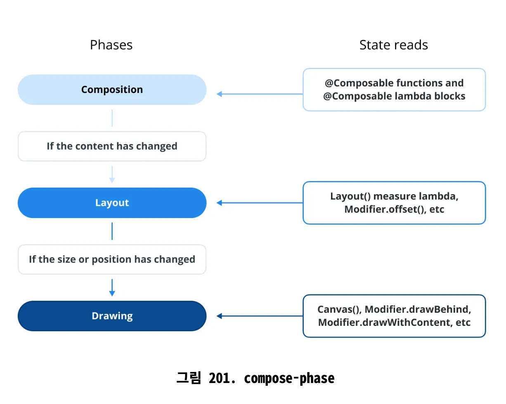

# Q) 1. Compose 페이즈(phase)에 대해 설명해 주세요.

Compose 는 UI 화면을 그릴때 Composition, Layout, Drawing 세가지 주요 단계로 나누어진 렌더링 파이프라인을 따릅니다.

### Composition

@Composable 함수 실행 UI 트리를 구축하여 컴포저블 함수에 대한 설명을 생성하는 역할

Slot Table 에 컴포저블 간의 관계를 기록한다.

- `@Composable` 함수 실행
- UI 트리 생성 및 업데이트
- recomposition을 위한 변경 사항 추적

### Layout

Compostion 바로 직후에 수행되는 단계로, UI 컴포넌트의 크기와 위치 결정

- UI 컴포넌트 측정
- 너비, 높이 및 위치 정의
- 부모 컨테이너 내 자식 배치

### Drawing

Composition 과 Layout 단계를 마친 UI 컴포넌트가 화면 렌더링 되는 절차

커스텀 드로잉 로직은 Compose의 Canvas API를 사용하여 구현

- 시각적 요소 렌더링
- 화면에 UI 컴포넌트 그리기
- 커스텀 드로잉 작업 적용

### 실전 질문

Q) Composition 단계에서는 어떤 일이 발생하며, recomposition과 어떤 관련이 있나요?

Q) Compose Phase에서 Layout 단계는 어떻게 작동하나요?